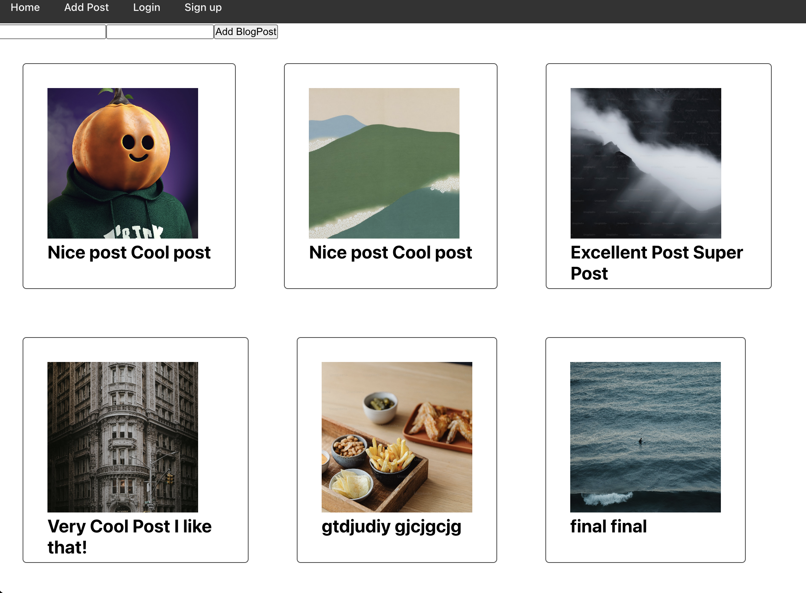

# My Blog App

This is the front end for a full stack app with login.

[] (https://www.google.com/)

## Build instructions

1. git clone https://github.com/alexartemov7/frontend-blogapp.git
2. cd frontend-blogapp
3. npm i
4. npm start

## Backend Repo
[Click here to view the backend] (https://github.com/alexartemov7/backend-blogapp.git)